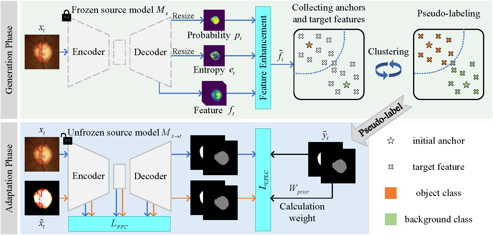

# :page_facing_up: Pseudo-label Clustering-driven Dual-level Contrast Learning based Source-free Domain Adaptation for Fundus Image Segmentation

<p align="center"></p>

### Dependency Preparation

```shell
cd PCDCL_SFDA
# Python Preparation
conda create -n PCDCL_SFDA python=3.8.5
activate PCDCL_SFDA
# (torch 1.7.1+cu110) It is recommended to use the conda installation on the Pytorch website https://pytorch.org/
conda install pytorch==1.7.1 torchvision==0.8.2 torchaudio==0.7.2 cudatoolkit=11.0 -c pytorch
pip install -r requirements.txt
```

### Model Training and Inference


- 1. Download the dataset and modify the relevant paths in the configuration file.
- 2. Source Model Train
  -- We use the code provided by [ProSFDA](https://github.com/ShishuaiHu/ProSFDA) to train the source model. If you want to use our trained source model, please contact me.
- 3. Generation phase: Generate target domain pseudo-labels
```shell
          python generate_pseudo.py
```
- 4. Adaptation stage: the source model adapts to the target domain
```shell
          python Train_target.py
```

### Citation ✏️ 📄

If you find this repo useful for your research, please consider citing the paper as follows:

```
@inproceedings{zhou2023pseudo,
  title={Pseudo-Label Clustering-Driven Dual-Level Contrast Learning Based Source-Free Domain Adaptation for Fundus Image Segmentation},
  author={Zhou, Wei and Ji, Jianhang and Cui, Wei and Yi, Yugen},
  booktitle={Chinese Conference on Pattern Recognition and Computer Vision (PRCV)},
  pages={492--503},
  year={2023},
  organization={Springer}
}
```